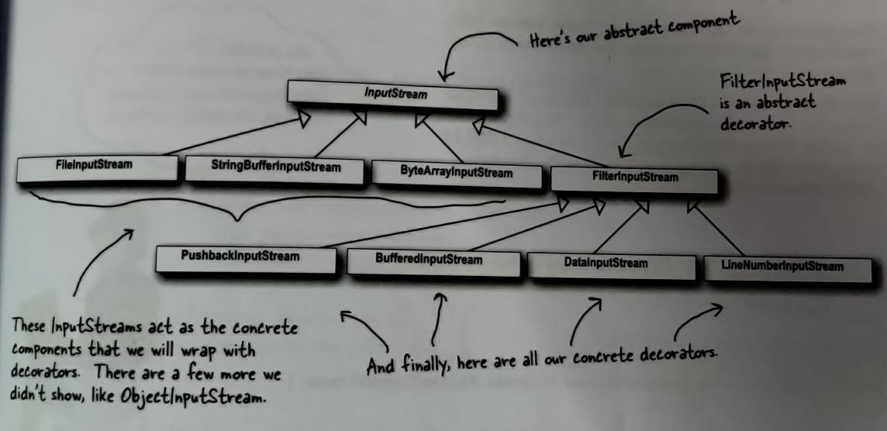

# Decorator Pattern
  
[Go Back](../README.md)
  
### **The Decorator Pattern** attaches additional responsibilities to an object dynamically. Decorators provides a flexible alternative to subclassing for extending functionality.
  
Key points:
  
- Decorators have the same supertype as the objects they decorate.
- You can wrap one or more decorators on an object.
- Decorators add their own behavior either before or/and after delegating to the object it decorates to do the rest of the job.
- Object decoration can be done dynamically.
  
Here below you can see a general diagram for the decorator pattern:
  

  
Here below you can see the class diagram of Beverage Example:
  

  
```diff
- Note: Decorator Pattern does specify an abstract component,
- but in JAVA, obviously, we can use an interface.
- So its your decision.
```
  
Java I/O also heavily uses decorator pattern. You will be able to understand it better using the image below:
  

  
In our JAVA example we are introducing a new Decorator, which converts a stream of characters in lower case.

### Java I/O also points out one of the *downsides* of the Decorator Pattern: `Designs using this pattern often results in a large number of small classes that can become overwhelming for some developers and can increase the chance of introduction of errors.` However, decorators are typically created by using other patterns like Factory and Builder. Once we cover those patterns we will see that the creation of the concrete component with its decorator is "well encapsulated" and doesn't lead to these kinds of problems.