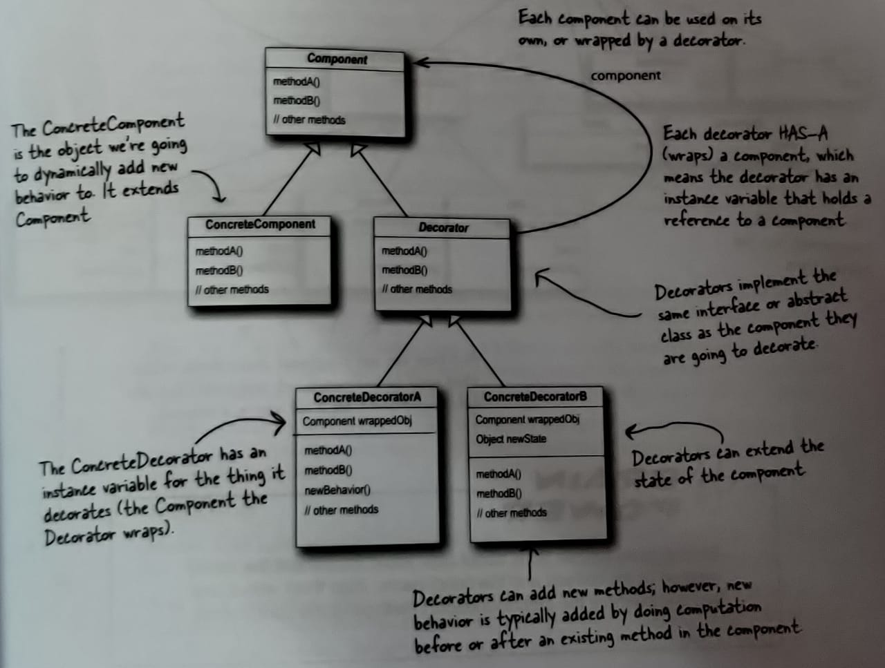
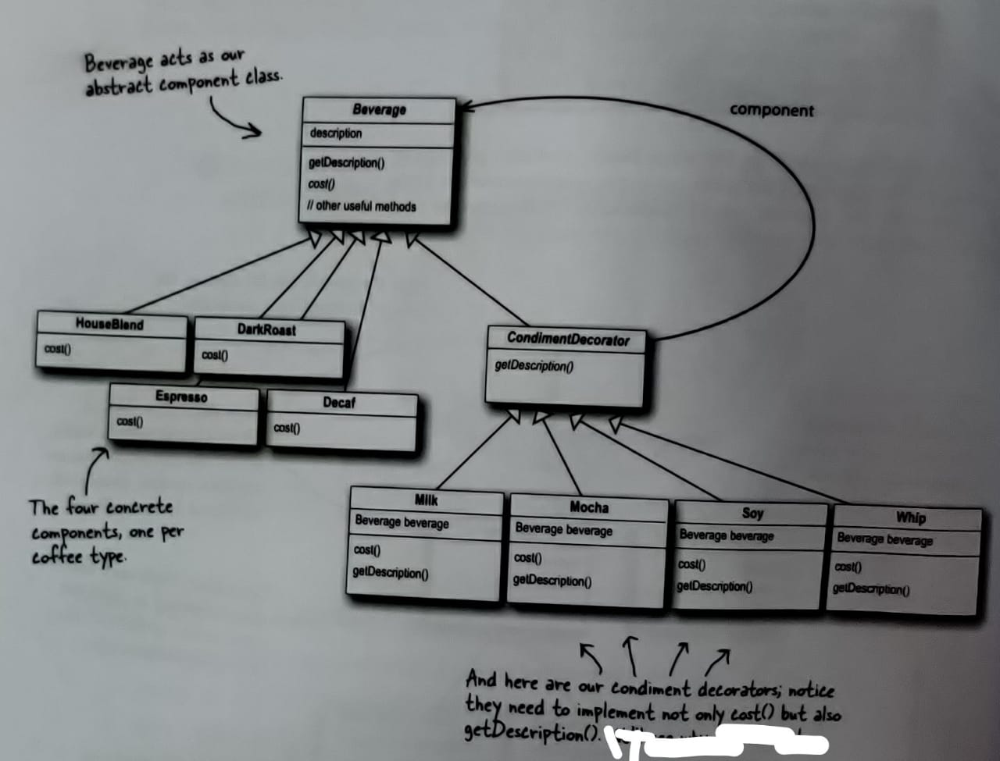

# Decorator Pattern
  
### **The Decorator Pattern** attaches additional responsibilities to an object dynamically. Decorators provides a flexible alternative to subclassing for extending functionality.
  
Key points:
  
- Decorators have the same supertype as the objects they decorate.
- You can wrap one or more decorators on an object.
- Decorators add their own behavior either before or/and after delegating to the object it decorates to do the rest of the job.
- Object decoration can be done dynamically.
  
Here below you can see a general diagram for the decorator pattern:
  

  
Here below you can see the class diagram of Beverage Example:
  

  
```diff
- Note: Decorator Pattern does specify an abstract component,
- but in JAVA, obviously, we can use an interface.
- So its your decision.
```