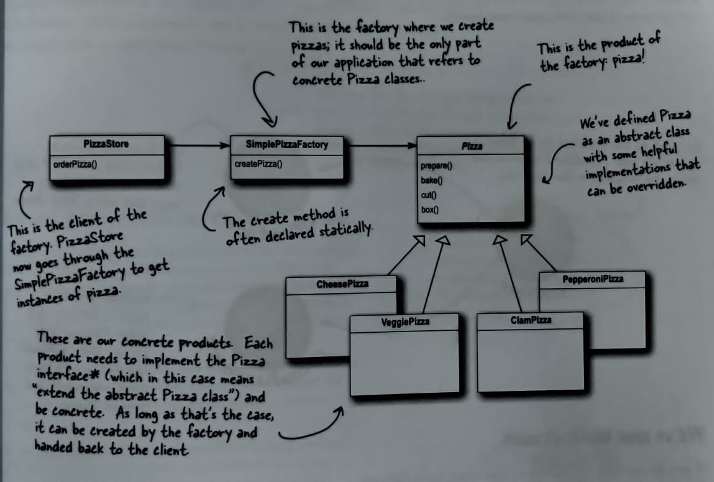

# Simple Factory
  
[Go Back](../notes.md)
  
When you have a whole set of concrete classes, often we are forced to write code like this:
  
```java
Duck duck;

if (picnic) {
    duck = new MallardDuck();
} else if (hunting) {
    duck = new DecoyDuck();
} else if (inBathTub) {
    duck = new RubberDuck();
}
```
  
This is troublesome because this code may have to be changed as new concrete classes are added. So, in other words your code will not be "closed for modification". To extend it with new concrete classes, you would have to re-open it.
  
Simple factory is in itself not a design pattern, its just a programming idiom. It will not be able to address the above problem completly, but it will start giving you insights in the Factory Pattern, and it will act as a base for how it will evolve in other examples.
  
In our example we will be trying to improve this OrderPizza method, given below:
  
```java
Pizza orderPizza(String type) {
    Pizza pizza;

    if(type.equals("cheese")) {
        pizza = new CheesePizza();
    } else if (type.equals("greek")) {
        pizza = new GreekPizza();
    } else if (type.equals("pepperoni")) {
        pizza = new PepperoniPizza();
    }

    pizza.prepare();
    pizza.bake();
    pizza.cut();
    pizza.box();

    return pizza;
}
```
  
Lets try to fallback to our first design principal: *"`Identify the aspect of your application that vary, and seprate them from what stays the same`"*
  
We can observe that object creation code varies when new concrete classes will be introduced, so it should be seprated from the orderPizza method. Creation of pizza should be something independent of ordering pizza. And other methods which require pizza will hence be able to access Pizza creation.
  
Below you can see the diagram of how simple factory works. This isn't something final but a start of re-design.
  
