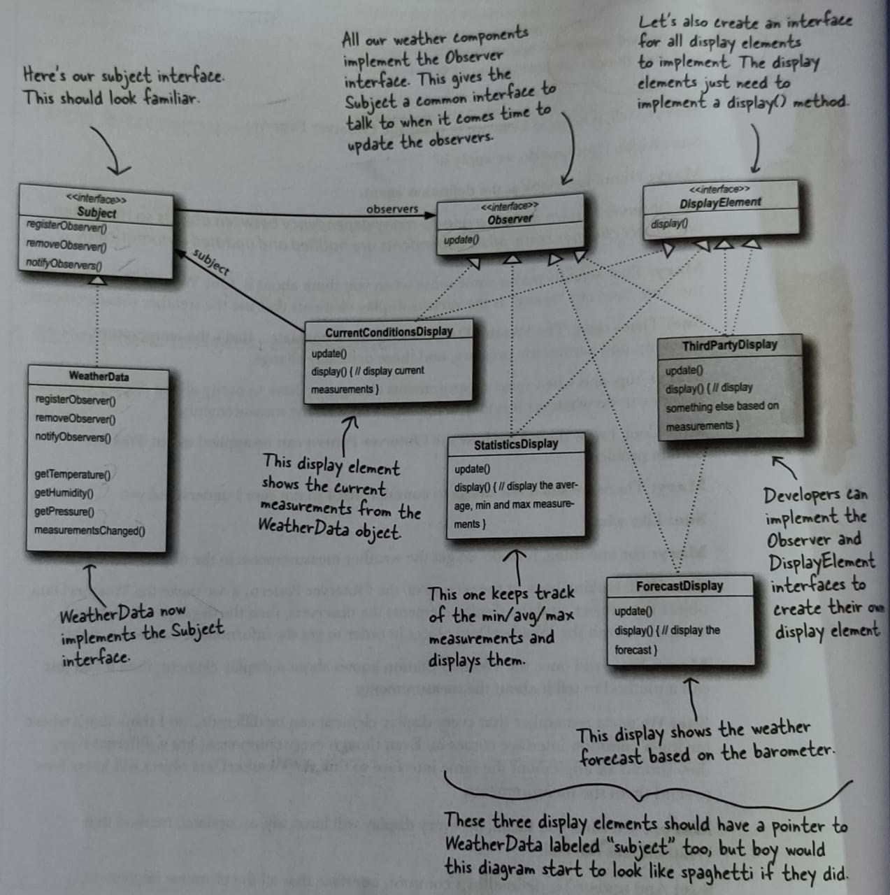
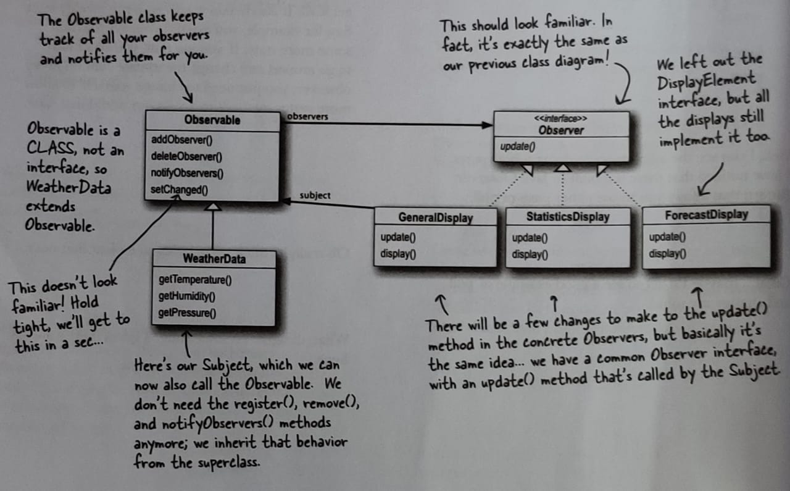

# Observer Pattern

###  **The Observer Pattern** defines a one-to-many dependency between objects so that when one object changes state, all of its dependents are notified and updated automatically.
  
> Did you notice last 2 words of above defination "updated automatically", we will see what it really means. Actually there are 2 types of implementation of observer pattern that I am actually implementing here (Push and Pull). Here you will see how these 2 words mean different for each of them.
  
  
The basic idea of this pattern is based on loose coupling.
  
When 2 objects are loosely coupled they can interact, but have very little knowledge of each other.
  
The observer pattern provides an object design, where subjects and observers are loosely coupled.
  
- The only thing that subject knows about an observer is that it implements a certain interface (the Observer interface).
- We can add/remove observers at any time
- We never need to modify Subject to add new types of Observers. The subject will deliver informationas long as the observer implements the Observer Interface.
- We can re-use subjects and Observers independently of each other.
- Changes to either the subject or an observer will not affect the other.
  
Now lets look at the 2 different types of observer patterns:  

- **Push Method**
    * Here what happens is that, when the state of Subject changes, it sends its complete state in the notification to the observers.
  
    * Class Diagram below:
    
- **Pull Method**
    * Pull method works differently, the difference is that it only notifies the observers that the state of Subject has been changed. So its upto the Observer to get the updated state from the Subject.
        * This has positives like:
            1. Suppose an observer only wants a particular part of the state of the Subject and is not interested in the whole state. So it fetches what it needs.
            2. Suppose Observer is busy in a task, and it doesnt want to start processing the changed state of the Subject. So here the Observer can do that later.
        * A negative that I can think of is:
            1. Its upto the observer to ask for the state, so there might be a case that when observer asks for a state the state of Object might have been altered, but the observer was not notified of that change because it has already unregistered from Subject, so you should always check if Observer is registered before fetching a state.
  
    * Class Diagram below:
    
  
> Note: The pull method that we implement here is provided by JAVA itself and is used in JDK also. This native implementation is good, but it has a down side that it doesnot follow the design principal "program to an interface not a an implementation". So basically we have to extend the Observable class. If you want to overcome this issue, you would have to implement it on your own. It wouldnt be that difficult, you already have your push implementation. It would just need few modifications
  
**If you are familiar with javascript, you will now understand how addEventListener uses Observer Pattern to perform the task**

> Note: At the time of writing this, JAVA has depreciated the *Observable* class and *Observer* interface. You can refer to [this](https://stackoverflow.com/questions/46380073/observer-is-deprecated-in-java-9-what-should-we-use-instead-of-it#:~:text=Ans%3A%20The%20Observable%20class%20and,for%2Done%20correspondence%20with%20notifications.) Stack overflow question for better understanding.