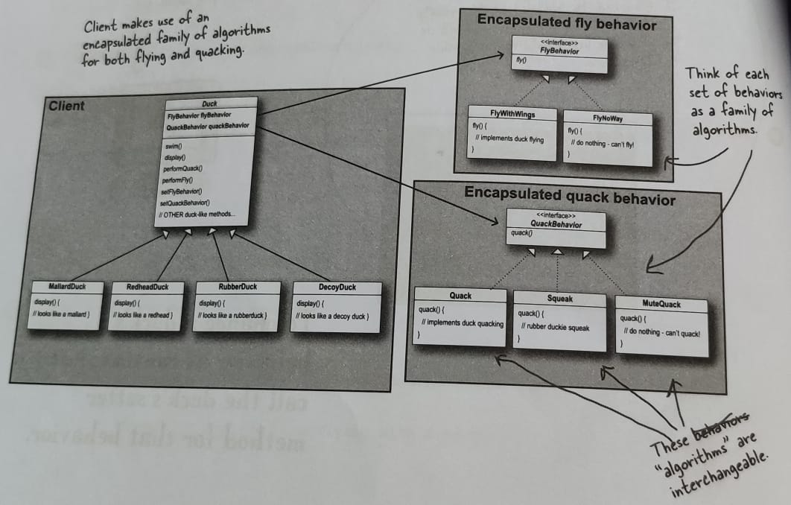

# Strategy Pattern

### **The Strategy Pattern** defines a family of algorithms, encapsulates each one, and makes them interchangeable. Strategy lets the algorithm vary independently from clients that use it.

The implementation of duck program can be illustrated by a class diagram (image below):

